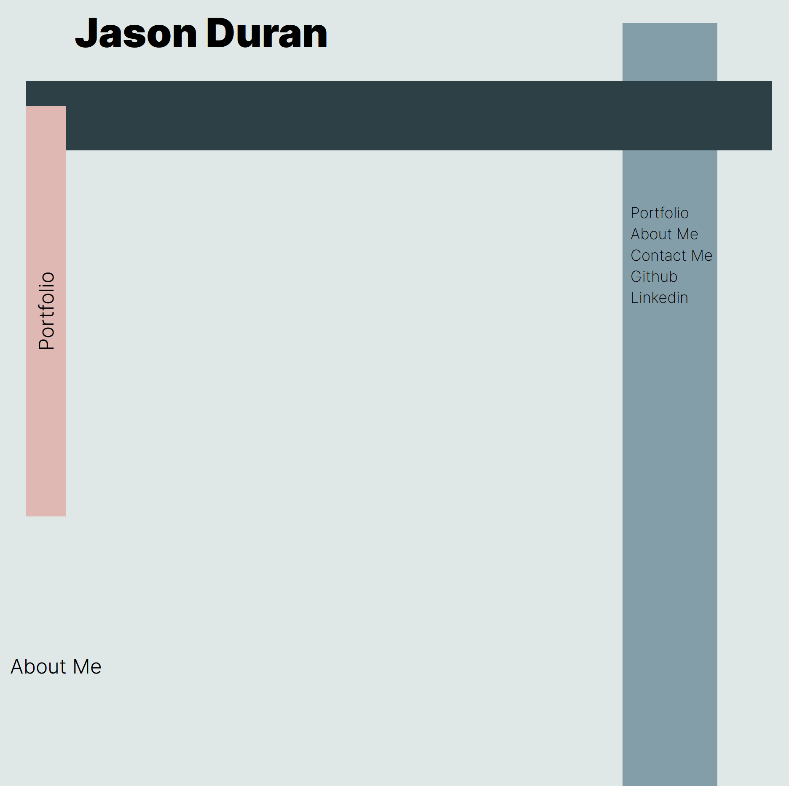

# jason-duran-portfolio

##Description
In this challenge I had the freedom to create a webpage comepletely on my own. There were a few things I had to include like: the first
image showcaseing an application should be the largest, the layout must be responsive, there must be working links, and the code should follow good html/css structure and style.

### URL

https://bluskreen.github.io/jason-duran-portfolio/

Not Finished ^
